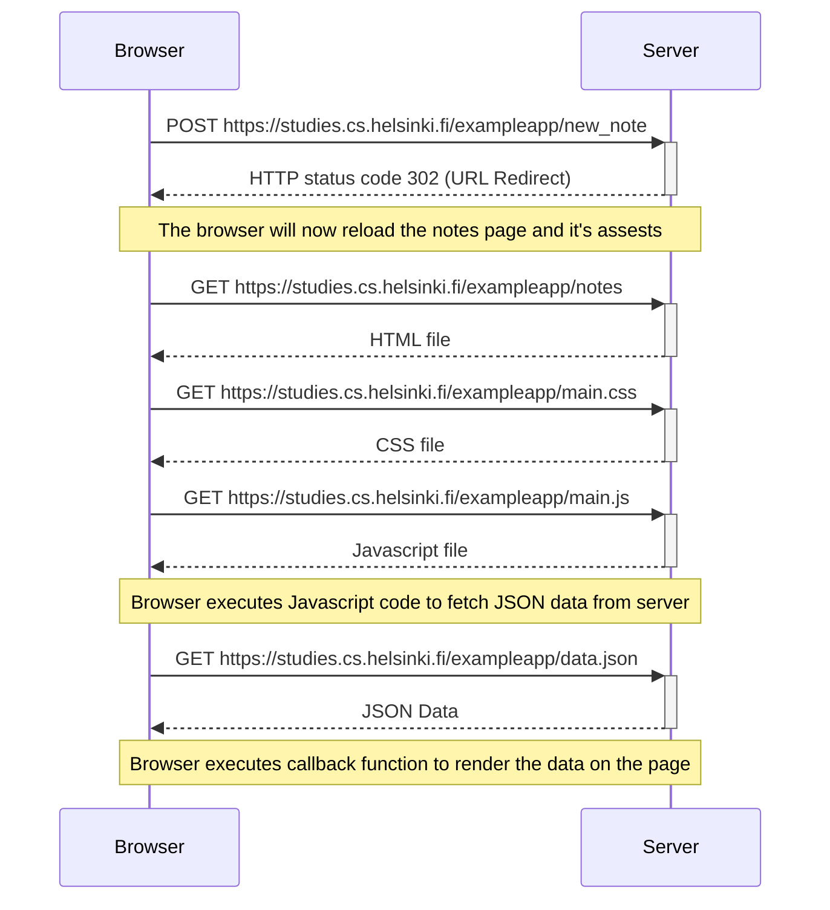

```mermaid
   sequenceDiagram
   
    participant Browser
    participant Server
    
    Browser->>+Server: POST https://studies.cs.helsinki.fi/exampleapp/new_note
    Server-->>-Browser:  HTTP status code 302 (URL Redirect)
    Note over Browser, Server: The browser will now reload the notes page and it's assests 
    
    Browser->>+Server: GET https://studies.cs.helsinki.fi/exampleapp/notes
    Server-->>-Browser: HTML file
    
    Browser->>+Server: GET https://studies.cs.helsinki.fi/exampleapp/main.css
    Server-->>-Browser: CSS file
    
    Browser->>+Server: GET https://studies.cs.helsinki.fi/exampleapp/main.js
    Server-->>-Browser: Javascript file
    Note over Browser, Server: Browser executes Javascript code to fetch JSON data from server
    
    Browser->>+Server: GET https://studies.cs.helsinki.fi/exampleapp/data.json
    Server-->>-Browser: JSON Data
    Note over Browser, Server: Browser executes callback function to render the data on the page
    
```
