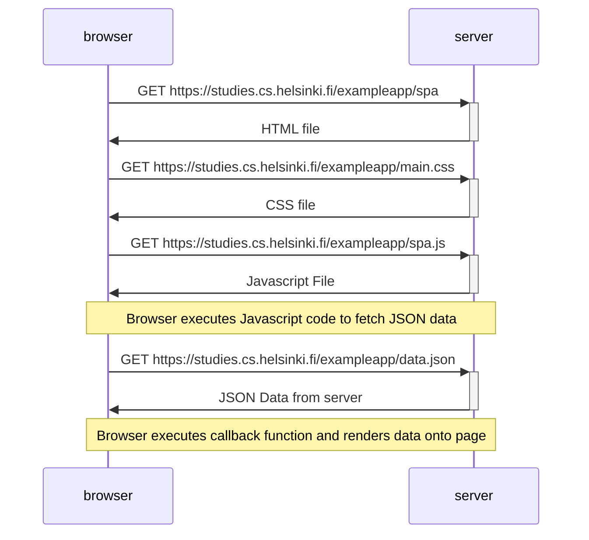

```mermaid
  sequenceDiagram
  
    participant browser
    participant server
    
    browser->>+server: GET https://studies.cs.helsinki.fi/exampleapp/spa
    server->>-browser: HTML file
    
    browser->>+server: GET https://studies.cs.helsinki.fi/exampleapp/main.css
    server->>-browser: CSS file
    
    browser->>+server: GET https://studies.cs.helsinki.fi/exampleapp/spa.js
    server->>-browser: Javascript File
    Note over server, browser: Browser executes Javascript code to fetch JSON data
    
     browser->>+server: GET https://studies.cs.helsinki.fi/exampleapp/data.json
    server->>-browser: JSON Data from server
    Note over server, browser: Browser executes callback function and renders data onto page
    
```
